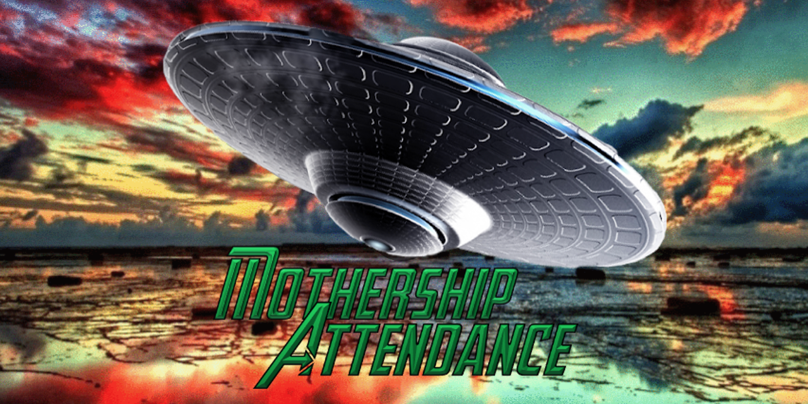

# TCP Automated Attendance (Mothership Attendance)

Mothership Attendance is a Java Swing/AWT application which functions as an attendance recording tool for a group of custom created attendee accounts. Other than the previously mentioned process, the application also gives user’s access to four separate features depending on the their selected account type. A list of these functions is provided below:

*	Profile Customization
*	Course Creation / Management
*	Attendee Chat Interface
*	Attendance Record Manipulation

The functions mentioned above, and their processes of implementation will be explained in depth further on. 

Upon starting the application, users are first greeted with an introductory screen that displays a progress bar and the project’s logo. The progress bar will continuously load while the application creates instances of certain overhead classes which it will need in order to function. While this occurs, a GIF image displaying multiple nature images will loop in the background until the current instance of the application has finished its preparation. The figures below show how the project may appear during this segment:

