<div align="center">
<h1 style="font-variant: small-caps;">Mothership Attendance</h1>
</div>


A lightweight, multithreaded Java application that automates classroom attendance by leveraging TCP socket communication between a central "Mothership" server and multiple student clients on a local network.

## 📌 Project Overview

**Mothership Attendance** replaces manual attendance-taking with a fully automated, client-server system. Each student connects to the host machine (Mothership), sending a unique ID that is logged in real time into a CSV file. Ideal for classrooms, trainings, or remote LAN-connected events.

## 🧩 Features

- 🔄 **Real-Time Attendance Logging** – Students instantly transmit unique IDs to the Mothership server for automatic attendance.
- 🧵 **Multithreaded Java Server** – Handles multiple student connections simultaneously with stable thread handling.
- 📁 **Automatic CSV Record Export** – Outputs timestamped `.csv` files with attendance logs for seamless recordkeeping.
- 🔒 **Works Offline via LAN** – Requires no internet connection; runs entirely over local networks.
- 💡 **Simple & Lightweight** – No GUI or external dependencies—just compile and run.

## 🖼️ Screenshots

**Client Interface:**  


**Server Logging View:**  


## 🛠️ Technologies Used

- Java SE 8+
- TCP Sockets
- Multithreading
- File I/O
- CSV Export

## ⚙️ Setup Instructions

> **Requirement:** Java JDK 8+ installed.

1. **Clone the repository:**
   ```bash
   git clone https://github.com/yourusername/Mothership-Attendance.git
   cd Mothership-Attendance


Mothership Attendance is a Java Swing / AWT application that functions as an automated, attendance recording tool for a group of custom-created attendee accounts. Other than the previously mentioned process, the application also gives user’s access to four separate features depending on their selected account type. A list of these additional features is provided below:

*	Profile Customization
*	Course Creation / Management
*	Attendee Chat Interface
*	Attendance Record Manipulation

The features mentioned above, and their implementation processes will be explained in depth further within the report. If you wish to skip to a particular section, please click on the corresponding link below in the table of contents:

#### Table of Contents
* [Database Implementation](#Database-Implementation)
* [Application Start](#Application-Start)
* [Login Screen](#Login-Screen)
* [Account Creation](#Account-Creation)
* [Welcome Screen](#Welcome-Screen)
* [Profile Customization](#Profile-Customization)
* [Management](#Management)
* [Chat Interface](#Chat-Interface)
* [Attendance Records](#Attendance-Records)
* [Attendance Server](#Attendance-Server)

<p align="center">A Video Walkthrough of the Mothership Attendance<br>Application can be found at the following link:</p>

<p align="center">
 <a href="https://youtu.be/7Z4EQI0jJ98"></a>
</p>
<br>

## Database Implementation
This application uses a remote database connection in conjunction with [MySQL](https://www.mysql.com/) to catalog progress from previous user sessions. The remote database is hosted by the online service [myPHPAdmin](https://www.phpmyadmin.net/) and is composed of seven separate tables. The ER Diagram below displays the names and property values of each table within the database and how they correlate to each other:

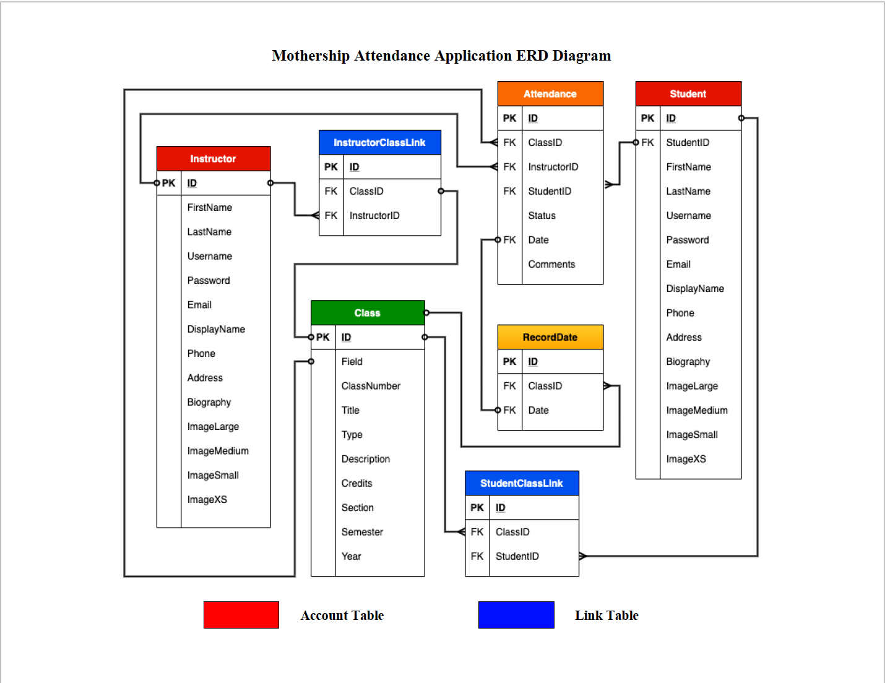

### Account Tables
There are two primary types of tables in the ER Diagram above. The "Instructor" and "Student" tables, which have red-colored headers, are classified as Account Tables. This type of table is responsible for holding the data associated with the user-created profiles in the application. While both the Instructor and Student Tables are classified as account type tables, they also accept different types of information in addition to having different primary and foreign key properties. For more information regarding the implementation of the Account Creation Segment, please reference the [Account Creation](#Account-Creation) Section. 

Unlike Instructor Accounts, which can only be identified via their unique database identification number and username properties, Student Accounts have a third unique property, a Student Identification Number (StudentID). Student Profiles are given this third property due to the heavy distribution and frequent reference of their basic profile information in the main window of the application in addition to the fact there will be a higher amount of students compared to the number of instructors. This design concept was implemented seeing as it is much easier to search for and keep track of the student's university/school-issued identification number as opposed to their generic database entry number. While this isn't currently necessary due to the small size of the remote database, should the number of student profiles ever reach an exponential size, it will increase the proficiency of database search algorithms and improve the program's overall efficiency.

A Student Account's display name, email address, and profile image properties are frequently shared and displayed on the Instructor's side of the Application. For instance, during a running instance of the Attendance Server, the Instructor's side of the application will display the following information after a student account has successfully connected:


Alternatively, the Student's side of the application will only show the display name and profile picture properties during a running Instance of the Attendance Server:


The application contains multiple other segments which similarly use student data.

This design style is implemented to regulate the amount of sensitive data being distributed and enforce the concept of least privilege. While the Student ID Number may not be considered sensitive within the actual scope of the application; should the program be used in a realistic university or school-based setting, it will ensure that the instructor accounts are the only individuals privy to such potentially damaging information.

### Link Tables
The second type of table located within the remote database is classified as a Link Table. These tables, which are classified by a blue-colored header, are responsible for linking the different account type profiles to a specific Class or "Course" database entry. This is done to shorten the range of available students that the application needs to iterate through before finding the target profile's information.

The **Instructor Link** & the **Student Link** Tables only contain three property fields. The first property in each is the database entry number which will be unique in each local table. The second property field is responsible for storing the "Course ID", or course database entry number, that the Student or Instructor profile is associated with. Finally, the last property in each table will be the respective Instructor or Student database entry number within the database.

Records within both tables are automatically deleted should a Student Account be removed from a class or an Instructor Account unlinks their profile from the course. More information about the Instructor course unlinking process can be found in the [Management Course Linking](#Management-Course-Linking) Section.

### Class Table
The Class Table is responsible for holding all of the auxiliary information related to a specific course object entry in the database. These objects were implemented to better group and categorize account profiles within the application. Additionally, they are used during situations when Instructors choose to unlink their account from a particular class while there are still Student Accounts associated with the Course Object. This feature was added in case a scenario such as an Instructor Swapping or Replacement occurs. It is mainly done to preserve the current categorization status of student profiles and their previous Attendance Records.

### Record Date Table
The Record Date Table is responsible for holding the individual dates that attendance has been taken for a specific course. There are multiple attendance records per student, class, and day present within the database. Thus, it would be highly inefficient to iterate through every single entry to find the records for a specific student on a given date. This table was installed to increase the application's efficiency by referencing each particular day that the current Instructor marked attendance for. Having these individual dates referenced allows for the database execution thread to quickly find Student Attendance Records associated with the user's chosen date. The date property within the table is a String variable in the format (XX/XX/XXXX). This table is mainly used during the Attendance Records Tab present within the Instructor's version of the Application.

### Attendance Record Table
The Attendance Record Table is used to hold individual Student Attendance Record Objects which are created each time an instructor marks role in a chosen course. Attendance Record Objects contain seven unique properties which are used to categorize and store information about the statuses and behaviors of Students per class period. 

The ID property is used to reference and differentiate between each separate Attendance Record in the table while the ClassID, StudentID, and InstructorID property fields are used as foreign keys meant to link the current entry to the Class, Student, and Instructor Tables present in the database. The date property is present to link the current attendance record with the date on which it was taken. This date can be found within the Record Date table and is used to promote program efficiency by limiting the record search range.

The status property is capable of holding one of three unique values. The property can hold a value of "Present" if the student has attended the class session while it will otherwise hold a value of "Absent". Finally, the third option, in which the record status is marked as "NYA", stands for the phrase "Not Yet Added." Whenever a student is added to a course that already has past attendance records, the application automatically creates attendance records for that student on the days where role was previously taken. The "NYA" status is applied to these new records so the teacher will know about the student's late enrollment and so the application won't factor these records into the final attendance average.

The final property, comments, is used to store a fixed-length string containing a short reminder or note concerning the student's behavior on that particular day. This value and the attendance status property can be changed anytime by the Instructor via the Attendance Records Tab in their version of the application.

## Application Start
Upon starting the application, users are first greeted with an introductory screen that displays both a progress bar and the project’s logo. The progress bar will continuously load while the application creates instances of certain overhead synchronized variable classes which it will need for the main screen of the application to function. While this occurs, a GIF image displaying multiple nature-scenic images will loop in the background until the current instance of the application has finished its preparation. The figures below show how the application will appear during this portion:

<br>
<br>
<p align="center">
 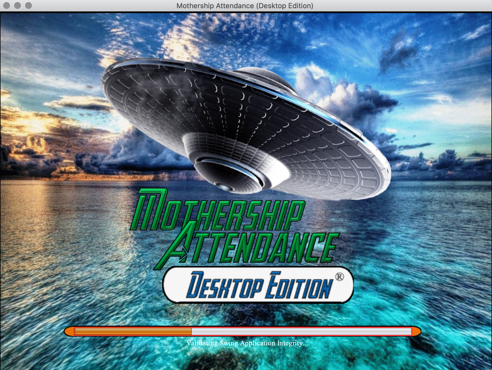
</p>
<br>
<p align="center">
 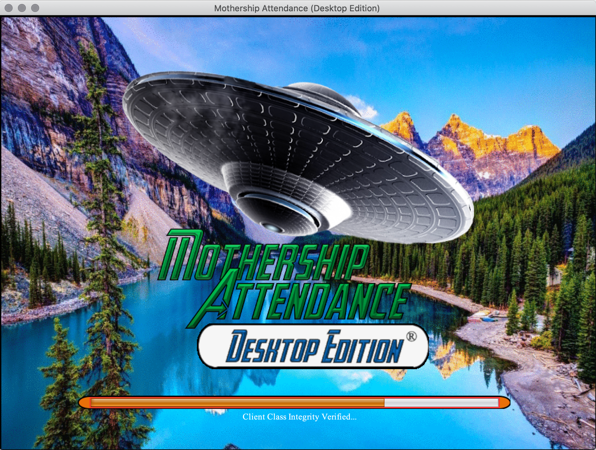
</p>
<br>

Users will then be shown a directory screen that provides a small set of instructions and allows them to choose between one of two separate designations. Individuals can choose to continue either as an “Instructor” or “Student” account by clicking the corresponding JButton Components. A user can then choose to either log in with a preexisting account or create a new profile via the "Create Account" JButton displayed at the bottom of the login screen. The image below shows how this directory segment of the application will appear:

<br>
<br>
<p align="center">
 
</p>
<br>

## Login Screen
During the login process, the application will authenticate the user-specified username and password values via a remote database search. Should the specified password value fail to match, or the defined username isn’t found, then the application will display a customized warning message that explains why the login process has failed. The login screen will appear the same way regardless of which designation button the user has clicked. The series of images below display how the login window will appear in addition to one of the few Warning Message Screens and how it will subsequently alter the aesthetic appearance of the GUI:

<br>
<br>
<p align="center">
 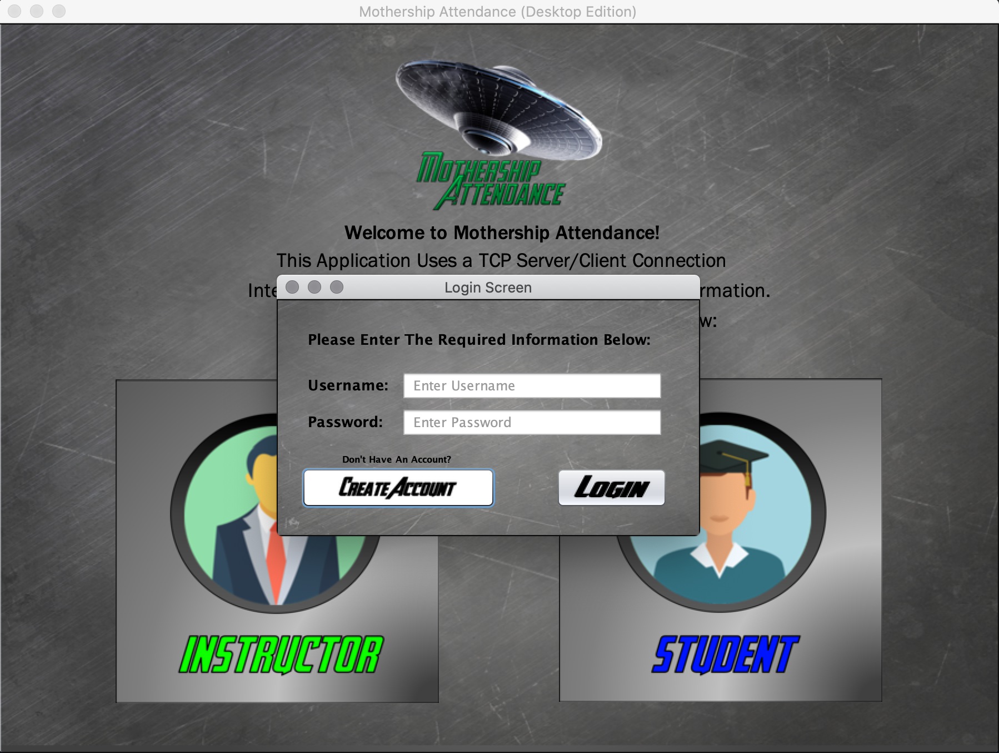
</p>
<br>
<p align="center">
 
</p>
<br>
<p align="center">
 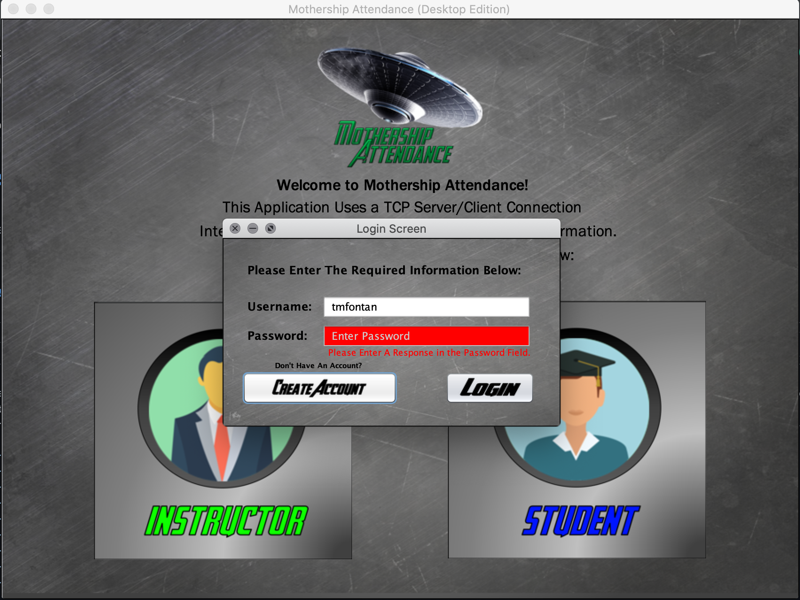
</p>
<br>

### Warning Message Screens
A Warning Message Screen will be triggered during the login process from one of five cases. As previously mentioned, should the username value not be found within the remote database, a warning message will be displayed, containing a yellow and white warning icon, that asks the user to either double-check the provided value or create a new account should the user not already have one. This message will also cause both the username and password JTextField Components to have red backgrounds in addition to creating a secondary warning message beneath the password JTextField on exiting the window. This feature was implemented to explain the cause of the error in case the user has already forgotten the reason after exiting the Warning Message Window. The red backgrounds and bottom error message on the login screen will then disappear once a user clicks into one of the JTextField Components to change its value or re-clicks the login button.

The second warning message will be triggered should the user only provide an invalid password value during the login attempt. The only differences between this Warning Message Screen and the previous one are that only the password JTextField Component's background will be colored red and the secondary warning message will contain different content.

The final three message types will simply be triggered should the user attempt to login without providing any input data. The three cases are when the user fails to provide just a username, just a password, or both a username and password. These three screens will follow the same principles as the screens above except for not changing a field's background color.

The rules mentioned above apply to the same types of input fields and conditions found throughout the entire application. They will all trigger a Warning Message Screen which follows the same principles above determined by the type of error occurring. Those errors will either be caused by a lack of input information, data not being verified, or a system error that will cause the aesthetic properties of the current screen to change. Regarding the system error type Warning Message Screens, should a system error occur, such as a failed database retrieval, lost internet connection, or server shutdown, then only a secondary warning message will be displayed upon exiting the window. The input field aesthetics will not be changed.

##

There is currently no penalty for numerous failed login attempts which greatly increases the vulnerability of the application. However, this feature will be implemented should the TCP Automated Attendance Application ever be used in a commercial setting.

Finally, should the user-inputted credentials end up being validated, the user will be presented with the following screen:

<br>
<br>
<p align="center">
 
</p>
<br>

During this time; there is an event queue thread, separate from the main thread, which is executing in the background of the Directory Screen GUI. This thread is tasked with waiting for the synchronized, continue to main screen boolean value, to be changed from its initial value of false to true. This boolean value will be changed once the user has clicked the OK JButton Component or exited the window shown in the previous authentication success screen. Once this value has been changed and the background event queue thread detects it, it will trigger the disposal of the current Directory Screen Instance in addition to creating a new instance of the Instructor / Student Main Screen GUI. Finally, the background thread will terminate upon finishing this task and disappear with the Directory Screen.

## Account Creation
A user can access the account creation window by clicking the "Create Account" JButton Component located at the bottom left of the login window screen. A custom account creation window will then appear which takes the place of the current login screen instance. The Account Creation Screen will be tailored differently depending on which designation the user has selected. The Instructor's version of the window will ask users to input seven different values of identification data while the Student's version will require eight. The Instructor's version of the Account Creation Screen will appear as follows:

<br>
<br>
<p align="center">
 
</p>
<br>

Alternatively, the Student's Version of the Account Creation Screen will be displayed as shown:

<br>
<br>
<p align="center">
 
</p>
<br>

As previously mentioned, both account creation processes require the user to input user identification information in multiple fields. The first two fields are meant to hold the user's first and last names. These values will later be combined to create the Display Name Property which is shown as both the profile name to other users in addition to the header name present in the profile tab. The third field is used to collect the email address that the user wants to associate with their account. Like the display name, this property is used for informational purposes when it is displayed on the screens of other client instances. In the current version of the application, the email address has no functional purpose; though this may be subject to change in later installments. The final four fields are used to determine and verify both the username and password values that the user wishes to use as their identification for the account. While the first username and password fields are simply used to store the user's selected value, the second fields under each component are used to verify the spelling of the chosen value. This feature is implemented to ensure that the user is completely aware of which password and usernames they wish to use. The username value associated with the account will be non-alterable after its creation seeing as the string value will be unique amongst all other Student and Instructor account username values in the database. Currently, there is no way for a user to change their chosen password value. However, this will be changed in later installments as well.

Each of the previously mentioned input fields will also require different specializations depending on the field. The specialization requirements can be found within the tooltip box that appears while hovering the mouse over an input field. For instance, both the First and Last Name fields require user input containing only alphabetic and certain special characters. The fields cannot contain values with numerical characters and only certain special characters such as the ( ' ) and ( - ) which are sometimes part of names. In contrast, the Email Address field allows the user to input numerical characters in addition to allowing more special characters to use. However, this field also has a length requirement of at least ten characters and must include the ( @ ) symbol somewhere within the input. This feature was implemented seeing as most modern-day email addresses are at least ten characters long and must have an ( @ ) symbol to denote the domain. The username and confirm username fields only require the user to input a response that is at least eight characters long and doesn't contain any special characters. This means that a person can use whichever alphabetic and numerical characters that they want in the creation of their username value. Finally, the password and confirm password input fields must contain values that are longer than eleven characters and have at least three numerical characters present within the value. There can be no special characters present within the string. This is done due to both security reasons along with the possibility of not having access to certain special characters on different machines.

The student's version of the account creation screen also has an additional input field with vastly different requirements. Whereas all the previous input fields required the entrance of a string value, the Student Identification Number input field, present within the Student Account Creation Window, will only allow the user to enter a number value inside the range of two million through ten million (2,000,000 - 10,000,000). This field is used to collect the university or school-issued student identification number which is unique to each person. This value can only contain numerical characters and will be frequently used to retrieve the student account's profile information during the main screen of the application.

The length property required in most of these fields was installed to better defend against cyber attacks. For instance, in a brute force attack, a malicious program will iterate over every possible password combination available after discovering the username to an account. Including uppercase and lowercase letters along with numerical characters, means that every single character within a password can be one of sixty-two possibilities. In terms of probability, that essentially means that a malicious program may have to iterate through 62<sup>11</sup> possible combinations before cracking the password. Even with how far computers have progressed, this process would still take even the fastest computers months if not years to complete. By this time, the password value would have been changed or the person executing the malicious program will have given up to find an easier target.

Should a user attempt to progress through either of the account creation windows before inputting all of the required information or the account creation process fails, it will trigger a customized warning message window that follows the same properties and actions as mentioned in the [Warning Message Screens](#Warning-Message-Screens) Segment.

Upon successfully creating an account, the user will be presented with the screen below before the background Directory Screen thread disposes of the window and replaces it with a new instance of the Main Screen Window:

<br>
<br>
<p align="center">
 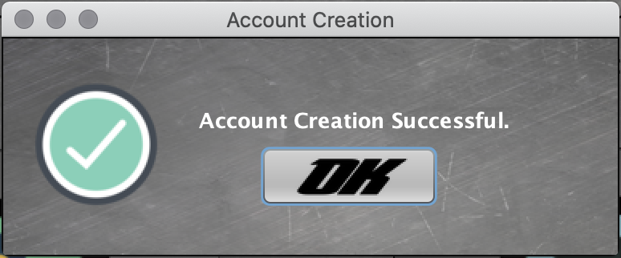
</p>
<br>

## Welcome Screen
The welcome screen is presented to a user after a successful login attempt or account creation process. This frame is denoted by a moving fractal GIF background overlayed with an artistic interpretation of Saturn and mountains. The screen shows the current version of the application and gives users a list of notes regarding all of the features, how to use them, and which account designation they are accessible by.

In the current version, the application has five features available for use. These features are the [Profile Customization](#Profile-Customization), [Management](#Management), [Chat Interface](#Chat-Interface), [Attendance Records](#Attendance-Records), and [Attendance Server](#Attendance-Server) Options which will be discussed further in the subsequent sections.

Lastly, the Welcome Screen has an admin button located on the bottom left of the screen which is used to connect with an admin should a problem with the application be found. Seeing as the application is still in the development stage, this button will instead just link to the remote database login web page. This website is only accessible to developers with the correct login credentials. In time, this process will be replaced with an email / online chat functionality.

The Welcome Screen will appear in the following manners upon first being initialized and loaded in: 

<br>
<p align="center">
 
</p>
<br>
<p align="center">
 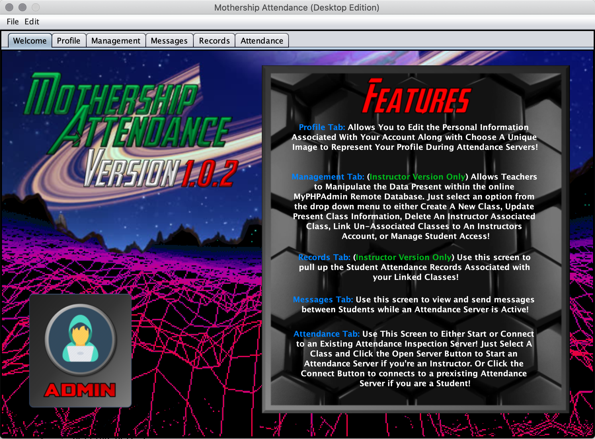
</p>
<br>

## Profile Customization
The first feature which is provided to both Instructor and Student Accounts is the ability to customize their contact information and profile appearance. A user can edit their profile by first clicking on the Profile Tab located in the top left of the Main Screen window. After doing this, the user will be greeted with some variation of the following images:

<br>
<p align="center">
 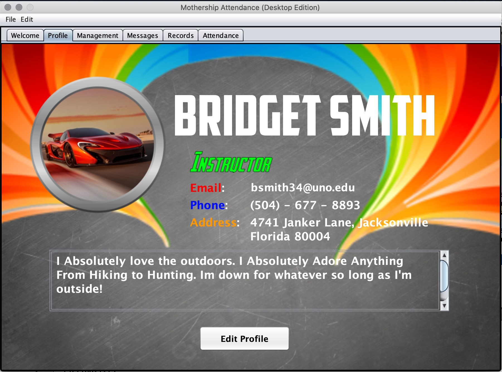
</p>
<br>
<p align="center">
 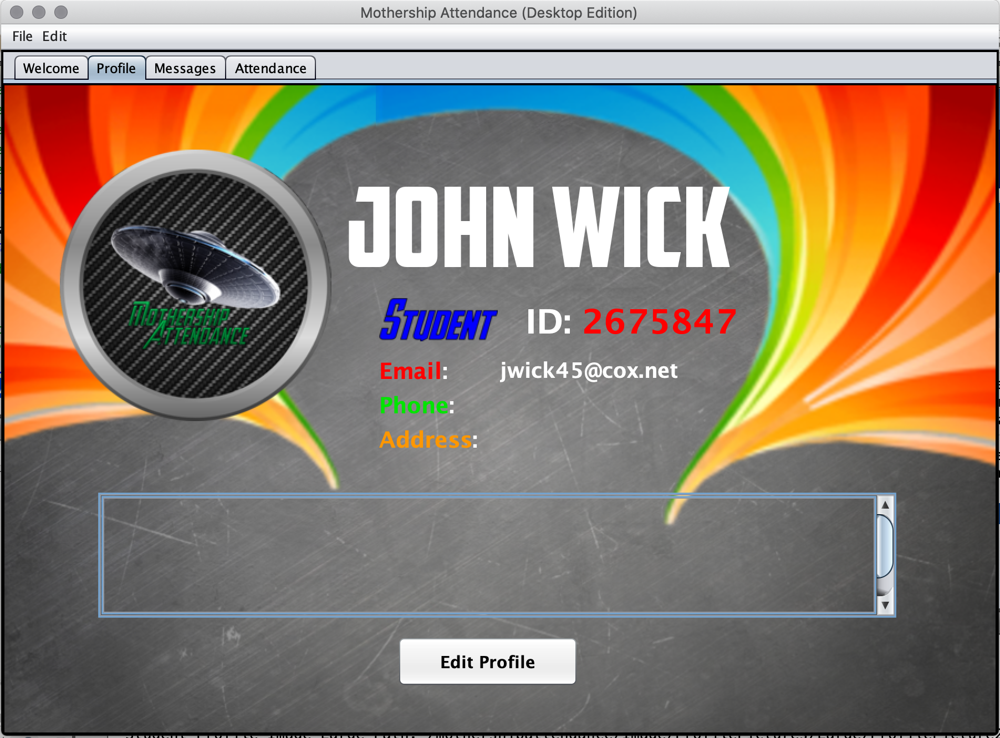
</p>
<br>

The first image is of an Instructor Account's Profile which has already been customized and filled with dummy data. The second image is of a recently created Student Account that still has all of its personal information fields empty. Users can choose to add a profile picture, phone number, physical address, and biography information to their profile. As seen in the first image above, these values will be displayed underneath the Display Name heading shown at the top of the window. The newly chosen profile image will replace the temporary image shown next to the Display Name. 

Currently, these informational segments are only visible to the user's profile. However, certain pieces of the information will be visible to both other Instructor and Student Accounts in a later release via the Attendance Server Function. As shown in the images above, the account's designation will be placed on the screen underneath the profile's display name heading. Additionally, Student Accounts will have their StudentID placed directly next to the designation.

To begin customizing the profile, a user can click the edit profile button located at the bottom of the window. From here, the user will be greeted with a variant of the following screen:

<br>
<p align="center">
 
</p>
<br>

To edit information on the screen, a user just needs to click on the default or current text shown. This will replace the current JLabel Component, which contains either the default or current text value, with the JTextField Component located beneath. The user's mouse will automatically be focused inside the text field which will contain the same default or custom text value. This process will appear as follows and applies for the email, phone number, address, and biography property fields:

(Note: The Display Name value is a static string that is a combination of the user's first and last names. It cannot be changed or altered.) 

<br>
<p align="center">
 
</p>
<br>

If an input field either contains the values " " or "Default", then it will automatically be deleted upon having the text field gain focus. The "Default" value will then reappear should the user exit from the input field without entering any information.

The phone number text field is what's known as a formatted field. This means that the box will only accept a ten-character numerical argument which is automatically placed inside the format (XXX) - XXX - XXXX. Unlike the plain text fields previously shown in the project, this component is automatically created with a set of rules. They don't need to be defined such as the StudentID numerical range or email character restriction that was implemented during the Account Creation process.

If a user wishes to change their current or the default profile picture selection, they first begin by clicking on the actual picture within the window. This will spawn the following window:

<br>
<p align="center">
 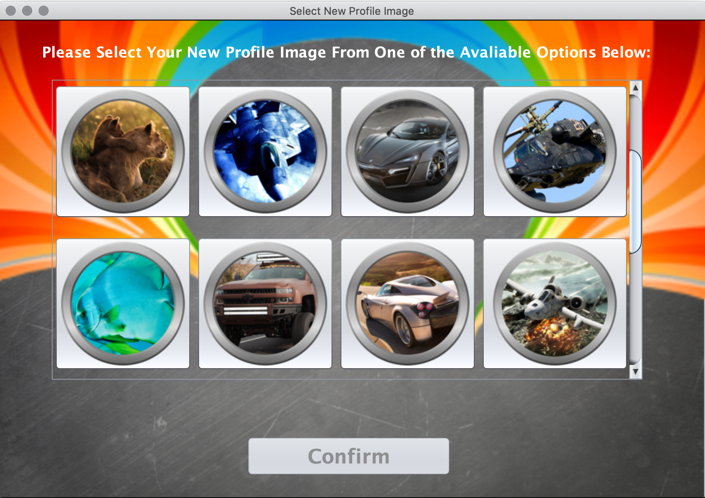
</p>
<br>

A user can select one of the thirty additional images as their profile picture. Upon clicking a picture, a JLabel will appear displaying the name of the image and the "Confirm" JButton will be accessible. Once a user selects the profile image that they want, they can click the "Confirm" JButton to exit from the window. This will update the profile picture in the previous window but not implement the change yet.

Once the user has finished customizing their profile, they can click the open lock picture located at the bottom left of the screen. This will save the changes made to the user's profile, updating the information within the main window along with sending the changes to the remote database. Clicking on the lock will replace it with an image of a closed lock, also stoping the user from being able to further edit the information. If the user wants to continue editing the information, they can simply re-click the lock image to re-enable all of the input fields for modification.

When normally dealing with graphical user interfaces, one of the most aggravating challenges deals with the scaleability of text. In other words, what happens should the user's chosen text value be larger than the bounds of its container component? Will the bounds of the component automatically be resized upon receiving input larger than its current pixel width, or will the specified text expand past the current frame's viewport? This is one of the many issues that designers and developers face during the creation of user interfaces. Input field properties such as font family and size also contribute to this issue. 

To solve this issue, the program uses a static Java Class, CreateImageFromText, which contains two methods that are called according to the font family being used. Each method accepts four arguments which are the current input value, container width, container height, and font size. The methods use these parameters to calculate the current pixel width of the text according to the font being used. Should the pixel width be longer than the viewport size, the font size is continuously decremented until its pixel width is less than the overall container's width. These methods are only called on the Display Name, Email Address, and Physical Address Fields on the main profile window. This is done seeing as the Phone Number Field will always be a fixed-length input that doesn't need to be resized and the Biography input value is wrapped in JTextArea component. In Java Swing, Text Scalability is only really a problem when dealing with JLabel components. JTextAreas implement a scrolling function that allows users to enter a specified row and column amount of input text without occupying additional space on the screen or extending the container's size. For instance, the JTextArea Components within the Profile Tab of the Main Screen and Edit Profile Window, allow users to enter up to twenty-five columns and twenty rows of information. This roughly translates to around twelve to fifteen sentences. The JTextArea Component is used in multiple other segments of the main application as well.

## Management Tab
The Management Tab is a feature only available to Instructor Accounts that allows users to manage and organize student enrollment. The Management Tab currently gives Instructors access to five different functions which are the Create New Class, Update Class Information, Delete Class, Link Un-Associated Classes, and Manage Student Access process. Each of these processes are capable of sending permanent changes to the database and affects the program functionality of other Student and Instructor Accounts; thus potential changes should first be approved through upper management before being implemented. The Management Screen Tab will first appear as follows on new instances of Instructor Accounts:

<br>
<p align="center">
 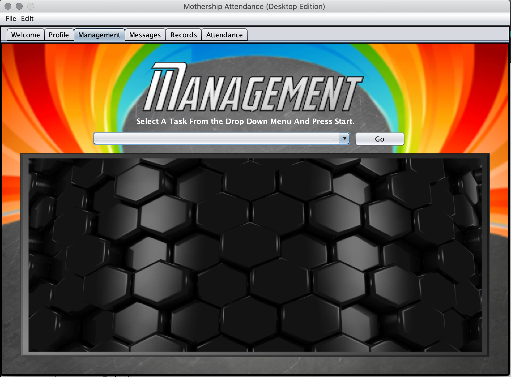
</p>
<br>

A user can then select an item from the Drop Down Menu to access each of the different functionalities. After selecting one of the options, the user will click the go button to show the functionalities interface. In case the user forgets, there is a small reminder shown above the menu which explains the process:

<br>
<p align="center">
 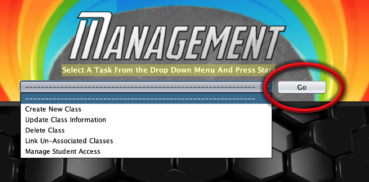
</p>
<br>

After selecting an option and clicking the "Go" Button, the chosen functionality's interface will be shown in the hexagonal rectangle below.

### Create New Class
The Create New Class Functionality is used to create a new Class or "Course" table entry within the remote database. As previously mentioned, courses are used to better categorize student accounts within the application and improve overall program efficiency. By linking a smaller group of student accounts to a single object, we are limiting the number of accounts that the database thread needs to iterate through to find the target account's information. Additionally, this allows the database thread to form lists of students and initiate changes on multiple pieces of information quicker. Upon loading in this functionality, the user will be greeted with the following screen:

<br>
<p align="center">
 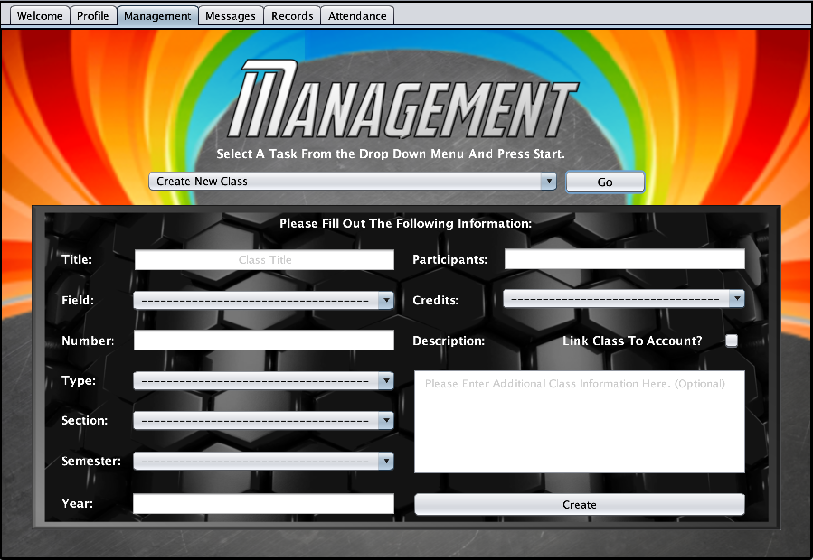
</p>
<br>

As seen in the image below, new course objects require multiple pieces of input information before being created. The new course object must contain a Title, Field, Number, Type, Section, Semester, Year, and Credit Hour Amount. Additionally, the new object must contain a specified amount of participants (Max Number of Students Enrolled in Class) and can also contain but doesn't require a description. The reason for this feature will be explained later in [Update Class Information](#Update-Class-Information) Section. This data structure is modeled after a realistic course entry in a University Database and is used to help both the application and user better differentiate between individual class objects. 

To better categorize the course object information in the database, most of the property fields are presented to the user in the form of drop-down menus. This is done so that there is no variation in the information which stops the program from wasting additional effort in forming comparison conditions. Essentially, it will speeds up the writing and reading processes from the database and improve overall program efficiency.

Finally, an Instructor must decide whether or not they wish to link the new course to their account. If the course is linked to the instructor's account, then it means that they can implement changes to the course at a later point in the form of editing the course's information, deleting it, and managing the students currently enrolled. The user can choose to link the course to their account via clicking the checkmark to the right of the "Link Class to Account?" JLabel Component:

<br>
<p align="center">
 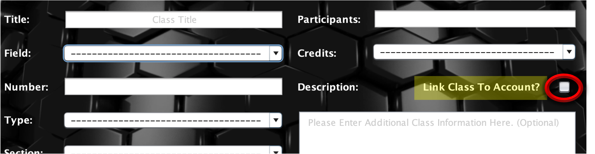
</p>
<br>

Finally, a user can click the "Create" JButton Component located under the Description box to create the new course. A small circling GIF Image will appear while the new object is being written and all of the input fields will be disabled while the new object is being written to the database. Once this process finishes, all of the input fields will be reset to their original default values and the user will be presented with some variation of the following screen:

<br>
<p align="center">
 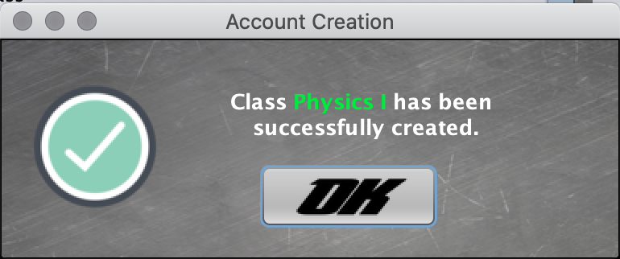
</p>
<br>

At this point, the user can choose to either continue making new classes or move on to a different part of the application.

### Update Class Information
The Update Class Information functionality is used to edit the information of a pre-existing course object that is already linked to the current Instructor's Account. This functionality can be accessed in the same manner as the [Create New Class](#Create-New-Class) functionality from within the Management Screen Tab. The interface for the Update Class Information Functionality will initially appear as follows:

<br>
<p align="center">
 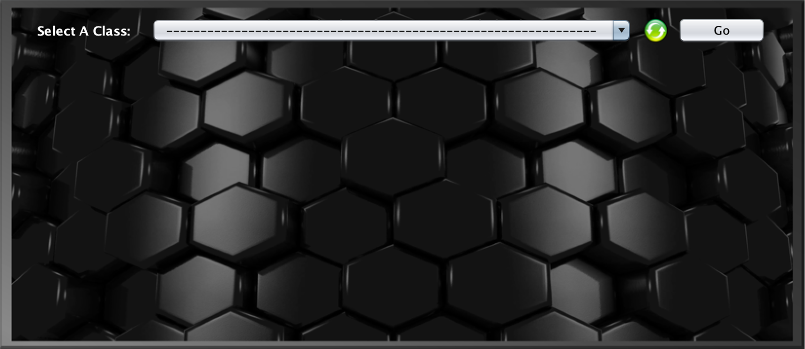
</p>
<br>

As seen above, the user will be presented with a JLabel containing instructions, a drop-down menu, and two button components. The drop-down menu will automatically be loaded with a list of the courses associated with, or "linked", to the current Instructor's account. This list of courses is automatically retrieved from the database and uploaded to each corresponding drop-down menu when the Welcome Screen is being loaded in. Furthermore, each drop-down menu within the application that uses the information, is updated every time the user creates a new class object and links it to his or her account. 

The green "Refresh" button is used in case the previously mentioned process fails:

<br>
<p align="center">
 
</p>
<br>

Clicking this button will cause all of the visible components in the Update Class Information functionality to be disabled while a background thread retrieves an updated list of the associated classes. During this time, the user can continue navigating around the Main Screen without any penalty. Once the process has finished, the drop-down menu will be updated with a list of the currently associated class and the components will be re-enabled for user interaction. These "Refresh" Buttons are available in all parts of the application where a drop-down menu is composed of dynamic data retrieved from the database.

If an Instructor Account is linked to multiple courses using the same Class Title (i.e "Calculus I" or "Physics II"), then the course will automatically be displayed using additional information. This is done so that both the user and the program can better differentiate between the two or more courses using the same title. An example of this technicality in action is shown below:

<br>
<p align="center">
 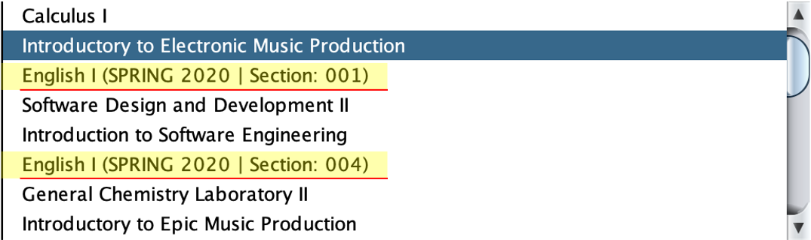
</p>
<br>

Once a user has selected one of their associated courses, they can click the "Go" JButton Component to load in the class's information. This will spawn a nearly exact replica of the "Create New Class" interface. However, this interface will already have the chosen course's information loaded into its input fields in addition to an additional button located towards the bottom of the screen. The new segment of the Update Class Information Functionality will appear as follows:

<br>
<p align="center">
 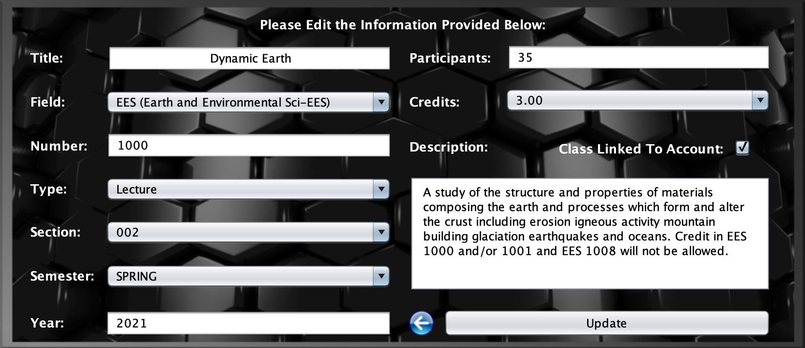
</p>
<br>

As shown in the image above, the current course's data properties will already be set inside of their corresponding fields. The text fields will automatically be set with the number or string data values contained in the class object while the static drop-down menus will all be set to the indexes corresponding with the saved info. From here, the user can edit the course properties in whatever manner they want. However, each input field must contain a custom response before attempting to save the changes. No field may be left with a blank or default answer/selection, or the interface will spawn a new Warning Message Screen to alert the user. The only field that can be left blank on the page is the course description.

After finalizing the new course information, the user can push the changes through via the "Update" button located towards the bottom of the form. This will disable all of the components and show a loading GIF Image until the background, database update process has finished. Once the process has been successfully executed, all of the components will be re-enabled for user interaction. If a user wishes to return to the first part of the interface, where they were able to select a course to edit, then they can click on the small blue backward arrow button at the bottom of the form. This will bring them back to the original part of the interface and reset all components within the interface to their default values.

The most important part of the Update Class Information Interface is related to the checkbox component located to the right of the "Class Linked to Account:" JLabel. Unchecking this box will unlink the currently chosen class from the Instructor's Account. This means that the Instructor will no longer be able to edit the course objects information or mark attendance for the Students within that class. The course listing will be removed from every dynamic drop-down menu in the application. This feature was installed in the case of an Instructor no longer being able to teach a course. When the checkbox is un-clicked, the course then becomes an "Un-associated Class" which is capable of being picked up by a different Instructor Account. This process preserves the course's connection with the list of students currently enrolled in addition to saving all of their previous attendance records. In the current version of the application, "Un-Associated Classes" can be picked up by any Instructor Account. However, additional security features regarding this feature will be installed in later versions of the application.

### Delete Class
### Link Un-Associated Classes
### Manage Student Access

## Chat Interface
## Attendance Records
## Attendance Server
